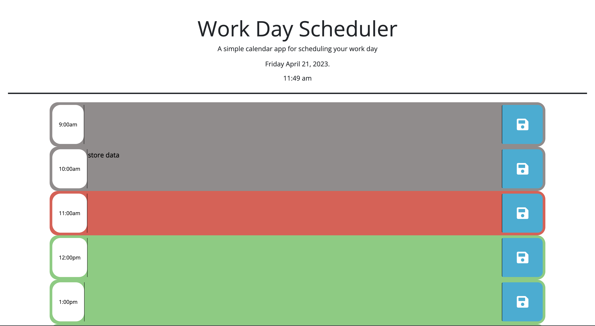

# Day-Planner
This web app allows you to plan your day by entering TODO's: into the text area. It will save your entry so you can re open the browser and your data will still be there! I used colors to mark if an hour has passed is coming or is present. The time is also displayed at the top. 

## Function
Enter a TODO: to see how it works!

###
Written by Christian Alteri

To learn more about my project, [click here](https://christianalteri.github.io/Day-Planner/).

####
MIT License
